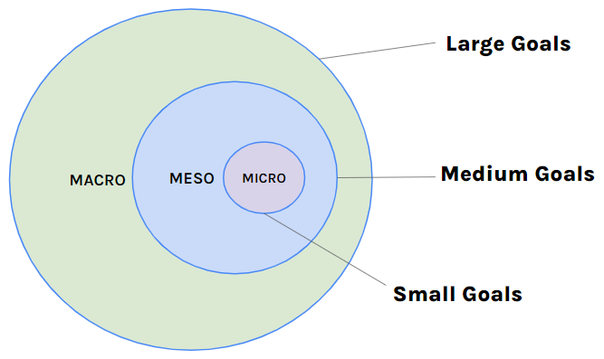

# Goal Setting

## Purpose

- The purpose of this project is to implement goal setting into your professional life. You will review how goal setting can lead to greater success and performance. Setting goals aids in honing your focus and dedication to tasks/events throughout your personal and professional life. Goal setting can increase your productivity and promote a sense of self-mastery. Without maintaining and measuring your goals and productivity you wouldn’t be able to improve upon these objectives. Managing your priorities now will help you begin identifying who you are and get you excited for the future.

- Starting these practices now will give you the upper hand when beginning to plan and organize your projects, job search, and future work tasks. Be sure you are implementing these tools throughout your time at Atlas.

## Description

- In this project you will begin consolidating and researching which goal setting and/or time management tools you would like to implement for yourself. Through the tasks you will need to find methods that will work for you so that you can begin practicing throughout the remainder or your time at Atlas. There are many ways this can be done, so be creative and use what best suits you!

## Resources

[How to prioritize tasks in 4 steps (and get work done)](https://intranet.atlasschool.com/rltoken/PSZ3eP-R_rW_MZ3yz1RaIA)

[How I use Notion to organize my school life](https://intranet.atlasschool.com/rltoken/m1ZavWq8CggcbJkzZgkcmw)

[48 Best & Free Notion Templates for Everything 2023](https://intranet.atlasschool.com/rltoken/QG8P_Ndp7elO5PVCyknZhw)

[How to use TRELLO - Tutorial for Beginners](https://intranet.atlasschool.com/rltoken/hfO1TWRaukbqBVJ7ou-ITw)

## Tasks

### 0. Set Your Goals

- Goal setting now will set you up for success this trimester, for graduation, and once you are employed.

- In a Google Doc begin planning out 2-3 goals you would like to reach within the next 3-12 months. Keep these within the realm of Atlas and/or employment to keep the focus more specific.

- In order to make these overall macro goals achievable, its important to have meso and micro goals listed under them. In your Google document, you should have 2-3 meso goals and 2-3 micro goals.

- For example:

  - I have macro goal to get a job at a Fintech company. I now need to evaluate what I need to prepare in order to reach this large goal. Therefore I will set up my meso goals:
    - Create my resume
    - Interview with a Fintech company

  - But in order to do those, I first need to set up my micro goals
    - Attend networking events
    - Have an Informational coffee with an engineer in Fintech

### 1. Schedule Your Priorities

- The Time Management Matrix was introduced by Dwight D. Eisenhower who believed that priority is related both to a task’s importance and its urgency. The higher the assigned priority, the more attention and time it merits. Stephen Covey then popularized and expanded on his ideas.

- Covey’s matrix is the combination of urgent/not urgent and important/not important As a result we have four quadrants that our priorities can fall into:

  - Quadrant 1: Urgent and important
  - Quadrant 2: Not urgent but important
  - Quadrant 3: Urgent but not important
  - Quadrant 4: Not urgent and not important

- Review the Time Management Matrix and resources below:

#### Resources

[What Is the Time Management Matrix and How to Use It](https://intranet.atlasschool.com/rltoken/eeLCudbzUwgjjJF9o6XukQ)

[The Covey Time Management Matrix Explained](https://intranet.atlasschool.com/rltoken/DA0gERmTgTFWNFML_tptHw)

[Time management matrix: How to fill out the sections](https://intranet.atlasschool.com/rltoken/929SMuybNF5h1y2MDnjc8w)

#### Requirements

- In the link provided below you will make a copy of the document and list your next week’s priorities (that would help you in your macro, meso, or micro goals above) and put them in each quadrant of the matrix based on your understanding.

[Complete the time management matrix here](https://intranet.atlasschool.com/rltoken/IkEx95WMZS5xdyi2IIrXIA)

### 2. Start, Stop, and Continue

- Now that you have determined where your priorities lie within the matrix. You should now solidify what you should start, stop and continue doing in order to meet your priorities and goals. Please keep these relevant to your previous steps (i.e. Atlas and career focused).

- In your Google document from Task 0, answer the following questions:

  - Where do you spend most of your time?
  - What is one thing you could start doing (that you are not currently doing) that if you did in on a regular basis, would make a tremendous positive difference for you?
  - What is one thing could stop doing that would also make a positive difference?
  - What is something you are currently doing that you believe is helpful and would like to continue?
